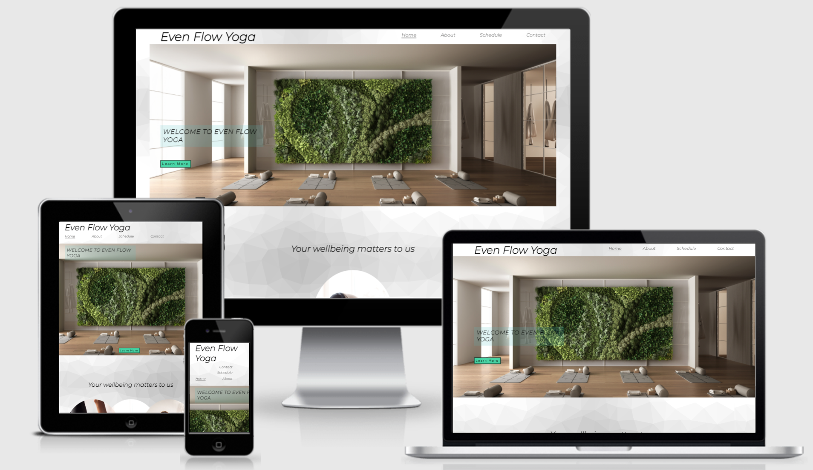

# Even Flow Yoga
Even Flow Yoga is a Yoga studio based in London, England. It is intended to help ordinary people become inspired to take up Yoga and Meditation. It is intend to supply information about the differnt classes in an easy and straight forward way, so people can book straight away and not feel intimidated by the site or discriptions of the classes.

-----
-----
## Features
-----

###  Logo and Navigation Bar
* The logo is on every page. By clicking on the Logo the user is able to navigate back to the home page at any point.
* The Navigation bar features 4 navigation links - Home, About, Schedule and Contact. They feature on every page and allow the user to navigate the site easily.

### The Home Page Image 
* The home page has a large photo of an empty, peaceful Yoga studio which is intended to entice and inspire the user.
* This section also has a text overlay to welcome the user to the studio site and also a **learn more** button which navigates to the About page so the user can move through the site quicker if they so wish.

### The Wellbeing Section
* This section features a header to make the user feel apart of the Even Flow Yoga family and also images of the most popular classes.
* The text under the images display the benefits of each class and the user can click on the text to naviagte to more infomation about each class. Once there they can book a class by clicking on the **Book Now** button which will take them to the Schedule page.

### The Footer
* The footer has links to three social media sites which will open in new tabs which is great for the user experience.
* The social media links help the user to learn more about the studio and experince the classes and atmosphre before commiting to anything
* The footer is available on every page of the website.

### The About Page
* The About page provides info about the studio and pictures of the classes.
* This page also provides a link at the bottom to the schedule page for easy and quick navigation.
* This is a very valuble page for the user as it shows what the studio is like inside and gives them an idea of what the classes and atmosphere is like.

### The Schedule Page
* This page allows the user to decide on and sign up for a class. It provides information on the differnt classes and when they are on.
* The user is able to fill in their info and pick a class to attend in a form as well as being able to ask a question.
* Once the form is submitted the user is navigated to a page confiming the class is booked.

### The Contact Page
* The page allows the user to find the studio on an interactive google map. It allow provides the studios address, email and phone number.

------
## Future Features
* Include a login/sign up page for members.
* Add an interactive booking system so members can see if classes are available.
* Add videos of recorded classes and links to live classes within the members area.
* Add information about the Yoga teachers
* Add a discount and special offer area/section.
-----
-----
## Technologies Used
------
### Languages
* [HTML5](https://en.wikipedia.org/wiki/HTML5)
* [CSS3](https://en.wikipedia.org/wiki/CSS)

### Libraries
* [Google Fonts](https://fonts.google.com/)
* [Font Awesome](https://fontawesome.com/)
* [rgbacolorpicker](https://rgbacolorpicker.com/)

### Tools
* [Gitpod](https://www.gitpod.io/)
* [Github](https://github.com/)
* [Balsamiq](https://balsamiq.com/)

-------
--------
## Testing
------
###
First I asked friends and family to look at the website and give me feed back on any issues they encountered with links and fuctionality. 
* Then I ran the code through [W3C Validator](https://validator.w3.org/) and these isssues were found and fixed -
1. index.html page
 
 

 2. about.html page

 
   
3. schedule.html page

4 contact.html page

* CSS code ran through [W3C CSS Validator](https://validator.w3.org)   and these isssues were found and fixed -

-----
-----
## Deployment

This Website was depolyed on Github pages.

1. Select the setting tab in the Github repository page.

2. Scroll down and click on the new dedicated tag line for Github pages.

3. From the source drop down menu select the master branch and click save.

4. The page will automatically refresh and indicate whether there has been a successful deployment.

The live link to the webpage can be found here - [Even Flow Yoga](https://j-r77-stack.github.io/Even-Flow-Yoga/)

------
------
## Credits
--------
### Media
* The images for the project were taken from [shutterstock](https://www.shutterstock.com/)

### Background Image

* The background image used throughout the whole site is from [cool backgrounds](https://coolbackgrounds.io)

* The map was taken from [Google maps](https://www.google.com/maps)

------

### Content
* The text info for the beginers yoga, Ashtanga and meditation pages
were taken from [wikipedia](https://en.wikipedia.org/wiki/Main_Page)
